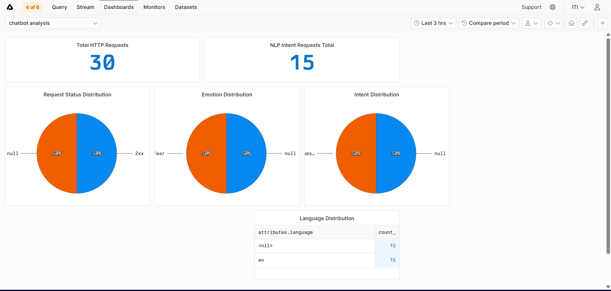

Check out the configuration reference at https://huggingface.co/docs/hub/spaces-config-reference

# Mental Health Support Chatbot

A smart, end-to-end RAG-based chatbot that understands what you're feeling and helps with mental health questions. It auto-detects your language, recognizes your emotions, and gives you thoughtful answers in your own language.

## System Overview

Complete AI pipeline that processes user input through multiple specialized NLP modules:

```
User Input (Any Language)
    ↓
Language Detection → Identify language
    ↓
Translation Pipeline → Convert to English (if needed)
    ↓
Emotion Classifier → Detect emotional state
Intent Classifier → Determine response type
    ↓
    ├─→ If asking_mental_health_question:
    │      RAG Pipeline → Search knowledge base & generate response
    │
    └─→ If greeting, goodbye, gratitude, or out_of_scope:
           Direct Response → Use LLM directly (no RAG)
    ↓
Translation Pipeline → Convert back to user's language
    ↓
User Response (In their original language)
```

## What This Chatbot Does

1. **Understands Your Language** - Auto-detects language and responds in the same language
2. **Reads Your Emotions** - Figures out how you're feeling and responds with empathy
3. **Knows What You're Asking** - Classifies your intent to route to the best response method
4. **Smart Routing**:
   - Mental health questions → Uses RAG (searches knowledge base)
   - Greetings, goodbyes, thanks → Direct response (uses LLM only)
   - Out of scope → Polite redirection
5. **Translates Seamlessly** - Handles multilingual conversations automatically

## Core Modules

| Module | Technology | Purpose |
|--------|-----------|---------|
| **Language Detection** | TF-IDF + Logistic Regression | Identify input language |
| **Emotion Classifier** | DistilBERT (Fine-tuned) | Detect emotional state |
| **Intent Classifier** | Groq LLM (Few-shot) | Classify user intent with examples |
| **Translation Pipeline** | Groq LLM | Multilingual translation |
| **RAG Pipeline** | LangChain + Qdrant + Groq | Knowledge-grounded Q&A |

## Getting Started

### Prerequisites
- Python 3.8+
- Docker
- Groq API Key (free: https://console.groq.com)
- Qdrant Cloud account (free: https://cloud.qdrant.io)

### Quick Start

**1. Setup:**
```bash
git clone <repo>
cd NLP-Final-Project
python -m venv venv
source venv/bin/activate  # Windows: venv\Scripts\activate
pip install -r requirements.txt
```

**2. Configure:**
Create `.env` file in the project root:
```
# LLM & Vector DB
GROQ_API_KEY=your_groq_api_key
QDRANT_URL=your_qdrant_cloud_url
QDRANT_API_KEY=your_qdrant_api_key

# Optional: For advanced features
HF_TOKEN=your_huggingface_token
LANGSMITH_API_KEY=your_langsmith_key
LANGSMITH_TRACING=true
LANGSMITH_ENDPOINT=https://eu.api.smith.langchain.com
LANGSMITH_PROJECT=mental-health-rag
```

**3. Run with Docker:**
```bash
docker run -it -p 8000:8000 --name mental-chat --env-file .env \
  -v ${PWD}/logs:/app/logs \
  -v ${PWD}/data:/app/data \
  chatbot_image:v4
```

**4. Run Backend directly (without Docker):**
```bash
cd RAG/api
python -m uvicorn app:app --reload --host 0.0.0.0 --port 8000
```

**5. Run Frontend:**
```bash
cd frontend
python -m http.server 5000
```

**6. Open browser:**
- Frontend: http://localhost:5000
- API: http://localhost:8000/health
- API Docs: http://localhost:8000/docs

**7. Run Tests:**
```bash
python -m pytest tests/tests.py -v
```

## API Documentation

### POST `/chat` - Send message

**How it works:**
1. Detects language & emotion
2. Classifies intent
3. **If mental health question**: Uses RAG (searches knowledge base)
4. **If greeting/goodbye/thanks**: Direct LLM response (no search needed)
5. **Otherwise**: Polite redirection
6. Translates response back to user's language

**Request:**
```json
{
  "question": "I'm feeling anxious",
  "session_id": "optional_session_id",
  "k": 4
}
```

**Response:**
```json
{
  "answer": "Response text...",
  "session_id": "session_id",
  "detected_language": "en",
  "emotion": "fear",
  "intent": "asking_mental_health_question"
}
```

**Intent values:**
- `asking_mental_health_question` - Uses RAG for knowledge-grounded response
- `greeting` - Direct response (e.g., "Hello! How can I help?")
- `goodbye` - Direct response
- `gratitude` - Direct response
- `out_of_scope` - Polite redirect to mental health topics

### DELETE `/chat/{session_id}` - Clear history

Clears conversation history for a session.

### GET `/health` - Health check

Returns `{"status": "ok"}`

## Project Structure

```
NLP-Final-Project/
├── main.py                          # Integrated pipeline (standalone demo)
├── requirements.txt                 # Dependencies
├── Dockerfile                       # Docker build config
├── docker-compose.yml               # Docker Compose config
├── otel-collector-config.yaml       # OpenTelemetry collector config
├── .env                             # Environment config (create this)
├── README.md                        # This file
│
├── RAG/                             # RAG-based Q&A system
│   ├── api/
│   │   └── app.py                   # FastAPI backend (main entry point)
│   └── src/
│       ├── __init__.py
│       ├── chain.py
│       ├── config.py
│       ├── emotion_classifier.py
│       ├── feedback.py
│       ├── history.py
│       ├── intent_classification.py
│       ├── language_detector.py
│       ├── llm.py
│       ├── prompt.py
│       ├── retriever.py
│       ├── runnables.py
│       ├── utils.py
│       ├── vectorstore.py
│       └── .env.example
│
├── modules/                         # Standalone NLP components
│   └── translation_pipeline/
│       └── translation_pipeline.py
│
├── models/                          # Trained model files
│   ├── emotion_classifier/
│   └── language_classifier/
│
├── config/                          # App configuration
│   └── logging.py
│
├── data/                            # Runtime data
│   └── feedback.json
│
├── logs/                            # Application logs
│   ├── app.log
│   └── error.log
│
├── frontend/                        # Web UI
│   ├── index.html
│   ├── app.js
│   ├── style.css
│   └── README.md
│
├── screenshots/                     # Documentation assets
│   ├── caching screenshots/
│   ├── tests screenshots/
│   ├── volume screenshots/
│   └── axiom-dashboard.png
│
└── tests/
    └── tests.py
```

## Technologies

- **Backend**: FastAPI, LangChain, Uvicorn
- **Models**: DistilBERT, Sentence Transformers
- **APIs**: Groq, Qdrant
- **Frontend**: HTML, CSS, JavaScript
- **Infrastructure**: Docker, OpenTelemetry
- **Databases**: Qdrant (vector)

# Monitoring & Observability

## Stack
- **OpenTelemetry SDK** — instruments the FastAPI app and collects metrics
- **OpenTelemetry Collector** — receives metrics from the app and forwards them to Axiom
- **Axiom** — stores, queries, and visualizes all telemetry data

---

## Metrics

### 1. NLP Metric — `nlp.intent_requests` (Counter)
**What it tracks:** Number of requests per predicted intent label (e.g., `mental_health`, `greeting`), also tagged with detected emotion and language.

**Why we chose it:** Intent distribution is the most direct signal of model health in an NLP pipeline. A sudden spike in unexpected intents means the classifier is confused or users are sending inputs outside the training distribution. Tracking intent over time also reveals usage patterns — for example, if most users are asking mental health questions, that validates the chatbot's core use case. We also tag emotion and language per request to get richer context without needing extra metrics.

---

### 2. Data Metric — `data.message_length` (Histogram)
**What it tracks:** Distribution of character lengths of user messages.

**Why we chose it:** Message length is a proxy for input quality and user behavior. Very short messages (under 5 characters) are likely noise or test traffic. Very long messages may cause latency spikes or hit token limits in the LLM. Tracking this as a histogram gives us percentile views (p50, p95, p99) to detect shifts in how users interact with the chatbot over time — without storing any raw message content, which protects user privacy.

---

### 3. Server Metric — `server.http_requests_total` (Counter)
**What it tracks:** Total HTTP requests broken down by endpoint and HTTP status code (e.g., `200`, `500`), grouped by status class (`2xx`, `5xx`).

**Why we chose it:** This single counter gives us both request throughput and error rate. By filtering to `5xx` responses versus total requests we get error rate without any extra instrumentation. Splitting by endpoint shows which routes are most used or most failing. It is the minimum viable server health signal and the first thing to check when something goes wrong in production.

---

## Axiom Dashboard

The dashboard visualizes all 3 metrics in real time:

| Chart | Metric | Type |
|---|---|---|
| Intent Distribution | `nlp.intent_requests` grouped by intent | Pie chart |
| Emotion Distribution | `nlp.intent_requests` grouped by emotion | Pie chart |
| Language Distribution | `nlp.intent_requests` grouped by language | Top list |
| Total HTTP Requests | `server.http_requests_total` count | Statistic |
| Request Status Distribution | `server.http_requests_total` grouped by status class | Pie chart |

### Dashboard Screenshot


